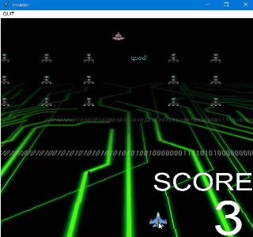
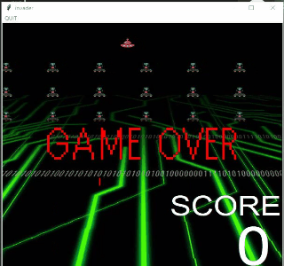
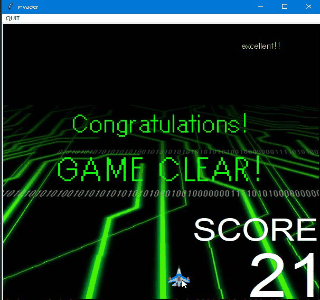
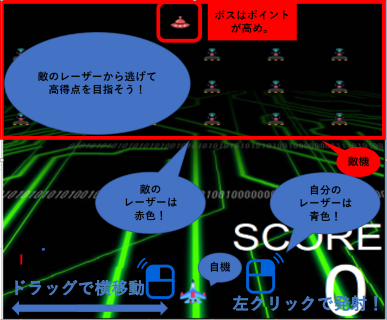

# 未来の射的（SHATEKI of FUTURE）
未来の射的を作成しました。
元のソースコード(https://github.com/ishikawa08/invader_game)<br>
にスコアボード・ボス戦を追加し、ゲーム性を向上させました！

 
# DEMO


<br>ゲーム開始画面:レーザーを撃って敵を倒そう！<br>

<br>ゲームオーバー：敵のレーザーに当たってしまうと負けてしまう！！<br>

<br>ゲームクリア：全員倒すとゲームクリア！<br>


 

 
# Requirement
 
"未来の射的（SHATEKI of FUTURE）"を動かすのに必要なライブラリなどを列挙する
 
* Python-3.7.19 or than later
* tkinter-8.6.9
* Pillow-8.3.2
 
# Installation
 
Requirementで列挙したライブラリなどのインストール方法を説明する
 
```bash
pip install Pillow
```
or
```bash
pip install -r requirements.txt
```
 
# Usage
* main.py,crab.jpeg,cannon.jpegをフォルダ内部に配置する。


* 実行はmain.pyを実行
```bash
python main.py
```
 
# How to use?
敵の発射するレーザーを避けて、敵を攻撃しよう！<br>
<span style="font-size: 200%;color: red; ">たくさん敵を倒して高スコアを目指せ！！</span>
<br>
移動→マウスドラッグ<br>
球発射→マウス左ボタン<br>
リスタート→ENTER


# Note
プレイ中にドラッグを解除しないでください。<br>
抜け出せないバグに遭遇した場合はENTERキーでリスタートしてください。
 
# Author
 
* 作成者 JP,あほたんけ,あめんぼ
* 所属　えぺ
* E-mail c0b20140d0@edu.teu.ac.jp
 
# SpecialThanks
* 元のコード<br>
作成者 ishikawa08様<br>
配布URL：(https://github.com/ishikawa08/invader_game)
* 画像引用<br>
無料素材サービス　株式会社シーマン様<br>
配布URL：(https://sozai.cman.jp/)
